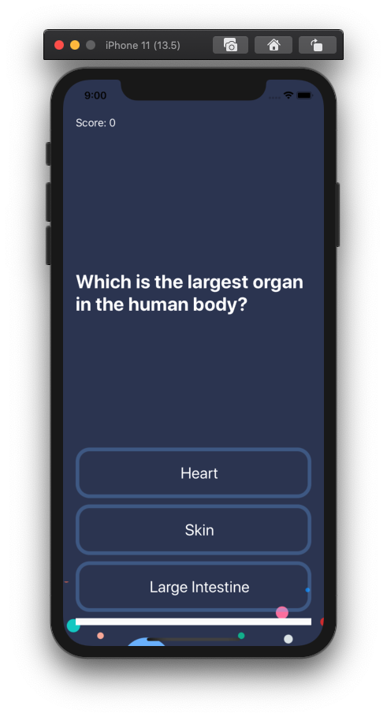
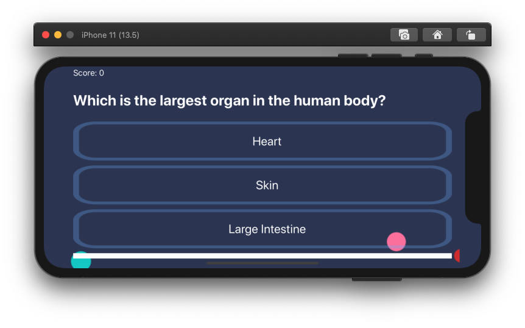
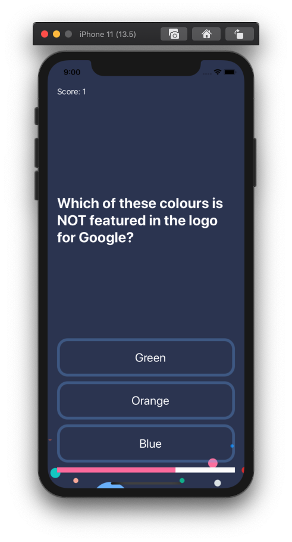
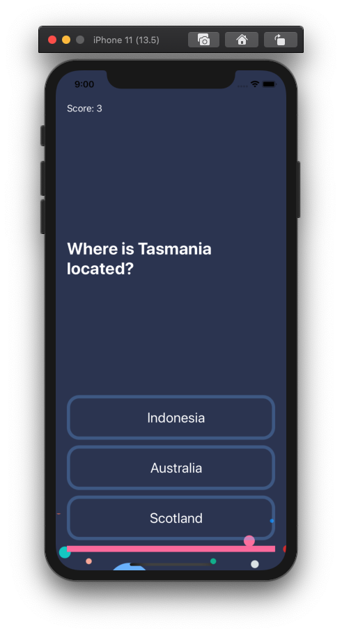

# Quizzler

## Goal

> 1. 1개의 질문에 대한 보기가 3개가 있음 
> 2. 질문에 대한 답변이 맞는 버튼을 클릭하면 노란색 불이 들어오며 틀리면 빨간색 불이 들어옴
> 3. 퀴즈가 진행되면서 하단의 ProgressBar도 함께 증가함
> 4. 제공된 질문이 모두 끝나면 다시 첫 질문으로 돌아옴
> 5. 좌측 상단의 Score는 문제를 맞추면 1 증가함, 첫 질문으로 돌아오면 0으로 초기화
> 6. MVC Design Pattern을 따름 (Model, View, Controller)

## 실행 화면

### 세로 모드

### 가로 모드

### 중간 지점

### 끝 지점

